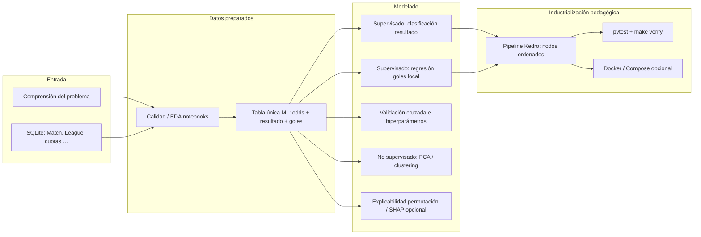

# Ciclo de ciencia de datos en este repositorio (visión amplia)

**Propósito:** enlazar una sola página el **camino típico** de un proyecto de datos (pregunta → modelo → reproducibilidad) con **artefactos concretos** de este proyecto: notebooks, código Kedro, datos y métricas.

**Complementarios:**  
- Metodología y métricas: [crispdm_y_machine_learning.md](crispdm_y_machine_learning.md)  
- Comparación modelo a modelo y flujo Kedro ↔ notebooks: [modelos_y_flujo_integrado.md](modelos_y_flujo_integrado.md)  
- Instalación y ejecución: [../GUIA_ESTUDIANTES.md](../GUIA_ESTUDIANTES.md)

---

## Diagrama del flujo (de la pregunta a la entrega reproducible)

En la práctica, **no tienes que seguir todas las ramas**: el guion docente habitual es **clasificación → regresión → explicabilidad → Kedro**; **validación cruzada** profundiza el modelado supervisado y **clustering** se usa como muestra del aprendizaje no supervisado.

---

## ¿Qué cubre el proyecto respecto del ciclo de ML?

| Fase típica de ciencia de datos | Cubierta aquí | Dónde se trabaja |
|---------------------------------|---------------|------------------|
| Planteamiento del problema | Sí | `01_*`, teoría CRISP-DM |
| Exploración y calidad | Sí | Notebooks `01`, `Exploracion_de_datos` |
| Wrangling / feature engineering | Sí | `02_preparacion_datos.ipynb`, nodo Kedro `build_ml_features_table` |
| Train/validation split reproducible | Sí | Parámetros en `conf/base/parameters.yml`, nodos ML |
| Clasificación multiclase | Sí | `03_*`, pipeline `ml_classification` |
| Regresión | Sí | `04_*`, pipeline `ml_regression` |
| Selección y afinado de hiperparámetros | Sí | `07_*` (`GridSearchCV`, `RandomizedSearchCV`). El `kedro run` por defecto usa un único split fijo pensado para clases rápidas. |
| Explicabilidad | Sí (permutación; SHAP opcional) | `05_*`, artefactos CSV de importancia |
| Aprendizaje no supervisado | Sí ilustrativo | `08_*` (PCA + K-Means + métricas de cluster) |
| Reproductibilidad del flujo completo | Sí | `python -m kedro run`, `make verify`, CI en `.github/workflows/ci.yml` |
| Contenedor / entorno aislado | Opcional pero documentado | `Dockerfile`, `docker-compose.yml` |
| Versionado de datos y artefactos medianos-grandes | Opcional | DVC (`dvc.yaml`, `docs/DATABRICKS_DVC_AIRFLOW.md`, `make dvc-repro`) |
| Programación institucional (Airflow DAGs) | Opcional | `integrations/airflow/dags/kedro_football_pipeline.py` |
| Lakehouse institucional (Databricks) | Opcional plantilla/doc | `integrations/databricks/` + guía combinada anterior |

Lo que este repo **no** pretende resolver al 100 % por sí solo: despliegue en producción (API, scheduling en nube), gobernanza de datos en tiempo real, ni inferencia batch en escala grande. Para docencia suele bastar llegar hasta **métricas, modelos serializados y pipeline versionable**.

---

## Mapa rápido: artefacto → archivo típico

| Artefacto | Ruta habitual |
|-----------|----------------|
| Base cruda | `data/raw/database.sqlite` |
| Tabla modelo (Parquet) | `data/05_model_input/features_for_ml.parquet` |
| Modelos `.pkl` | `data/06_models/*.pkl` |
| Métricas JSON | `data/08_reporting/*metrics.json` |
| Importancias / explicaciones tabuladas | `data/08_reporting/*.csv` |
| Parámetros y catálogo | `conf/base/parameters.yml`, `conf/base/catalog.yml` |
| Código de nodos Kedro | `src/analisis_equipos_de_football/pipelines/` |

Este mapa permite al estudiante ubicar cada etapa cuando explique la entrega («qué entrada, qué transformación y qué salida» por fase CRISP-DM).
