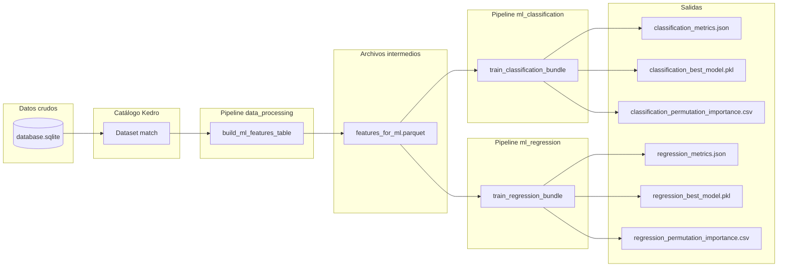
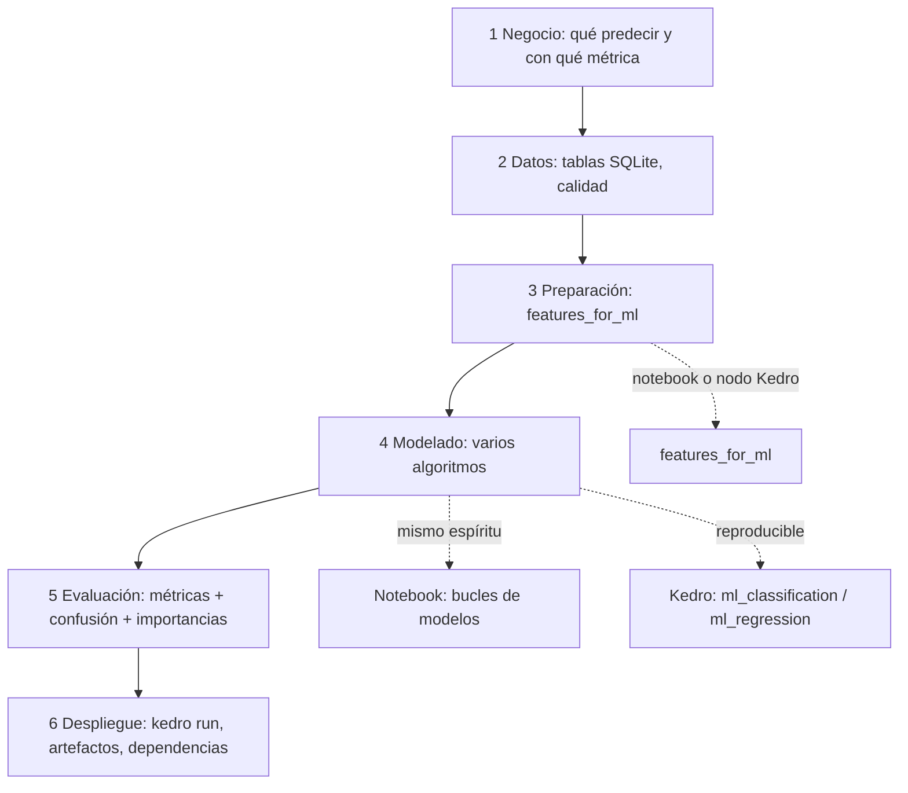

# Modelos de machine learning y flujo integrado del proyecto

Documento para **explicar en clase** cómo encajan los algoritmos que usa el repositorio y cómo se integran con **CRISP-DM**, el **notebook** y los **pipelines Kedro**. Convive con la guía [crispdm_y_machine_learning.md](crispdm_y_machine_learning.md).

---

## 0. Secuencia de notebooks (docencia paso a paso)

Los archivos `01_…` a `06_…` en la carpeta `notebooks/` siguen CRISP-DM en orden; el índice con descripción de cada uno está en [notebooks/README.md](../../notebooks/README.md). El archivo `Exploracion_de_datos.ipynb` es la variante **todo-en-uno** para repaso o demo rápida.

---

## 1. Vista de conjunto: dónde vive cada cosa

| Qué quieren hacer los estudiantes | Herramienta | Qué obtienen |
|-----------------------------------|-------------|--------------|
| Explorar tablas, graficar, probar ideas rápido | `notebooks/Exploracion_de_datos.ipynb` + `kedro jupyter lab` | Iteración visual; mismas tablas que el catálogo (`catalog.load(...)`) |
| Fijar un flujo reproducible y entregable | `kedro run` | Parquet, JSON de métricas, modelos `.pkl`, CSV de importancias |
| Cambiar columnas o split | `conf/base/parameters.yml` | Sin tocar código (ideal para ejercicios guiados) |
| Entender qué datos entran/salen | `conf/base/catalog.yml` | Nombres de datasets y rutas |

**Mensaje clave para el aula:** el notebook y Kedro no compiten: el primero sirve para **pensar y enseñar**; el segundo para **cerrar** el ciclo CRISP-DM (especialmente preparación → modelado → evaluación → artefactos versionables).

---

## 2. Diagrama del flujo de datos (Kedro + disco)

**Orden de ejecución del proyecto:** `data_processing` → `ml_classification` → `ml_regression` (definido en `pipeline_registry.py`). Cada bloque es una **fase de modelado/evaluación** apoyada en la misma tabla de features.

---

## 3. CRISP-DM superpuesto al repositorio

---

## 4. Idea de “Pipeline” en scikit-learn vs Kedro (evitar confusiones)

| | **sklearn.pipeline.Pipeline** | **kedro.pipeline.Pipeline** |
|--|------------------------------|-----------------------------|
| **Propósito** | Encadenar **pasos sobre una fila de datos** (ej. escalar → clasificar). | Encadenar **nodos de proyecto** (cargar SQL → guardar Parquet → entrenar → guardar JSON). |
| **En este repo** | `StandardScaler` + `LogisticRegression`, etc. | `data_processing`, `ml_classification`, `ml_regression`. |
| **Analogía para estudiantes** | “Receta para procesar **un ejemplo**.” | “Línea de montaje del **proyecto completo**.” |

Un modelo guardado en `.pkl` suele ser ya un **Pipeline de sklearn** (cuando aplica) o un estimador suelto (Random Forest sin escalado previo).

---

## 5. Guía por modelo: qué decir en clase

A continuación, cada bloque sigue la misma estructura: **idea**, **cómo decide**, **en este proyecto**, **qué tunear**, **caveats**.

### 5.1 Regresión logística multiclase (`LogisticRegression`)

- **Idea:** modela la probabilidad de cada clase como función **lineal** de las variables (después del escalado, de las variables estandarizadas). En multiclase suele usarse **softmax** sobre esas combinaciones lineales.
- **Cómo decide:** fronteras de decisión **lineales** en el espacio de features. Si el problema necesita fronteras muy retorcidas, quedará corta frente a árboles.
- **En este proyecto:** `SkPipeline([StandardScaler, LogisticRegression])` en clasificación. Es el **baseline interpretable** más sólido.
- **Hiperparámetros típicos a comentar:** `C` (fuerza de regularización; aquí se usa el default), `max_iter`, `solver`.
- **Para estudiantes:** los **coeficientes** (tras escalar) indican dirección de asociación con el log-odds; **no** implican causalidad ni “importancia” absoluta sin comparar escala y correlación entre cuotas.

### 5.2 Máquina de vectores de soporte lineal (`LinearSVC`)

- **Idea:** busca un **hiperplano** que separe clases maximizando el **margen** (y penalizando violaciones con la pérdida hinge).
- **Cómo decide:** también **lineal**; puede comportarse distinto a la logística ante outliers o clases solapadas.
- **En este proyecto:** pipeline con escalado; `dual=False` es adecuado cuando hay **más filas que columnas** (típico aquí).
- **Hiperparámetros:** `C` (margen vs errores en entrenamiento).
- **Caveat:** por defecto **no** entrega probabilidades calibradas (`predict_proba` no está en la misma forma que en `LinearSVC` estándar sin calibración adicional).

### 5.3 k-vecinos más cercanos (`KNeighborsClassifier`, k=15, pesos por distancia)

- **Idea:** **no** hay fase de entrenamiento con parámetros globales; el “modelo” es el conjunto de entrenamiento. La predicción es la **opinión de los vecinos** más cercanos en el espacio de features.
- **Cómo decide:** región local; muy flexible, pero sensible a la **maldición de la dimensionalidad** y a columnas sin escalar.
- **En este proyecto:** escalado obligatorio; `weights="distance"` da más voto a vecinos más cercanos.
- **Hiperparámetros:** `n_neighbors`, métrica de distancia, pesos.
- **Caveat:** predicción **lenta** si el dataset crece (compara con árboles).

### 5.4 Bosque aleatorio — clasificación (`RandomForestClassifier`)

- **Idea:** combina muchos **árboles de decisión** entrenados con **muestras bootstrap** del train y **subconjuntos aleatorios de features** en cada división (**bagging** + aleatoriedad de atributos).
- **Cómo decide:** particiones **axis-aligned**; captura **no linealidades** e **interacciones** sin especificarlas a mano.
- **En este proyecto:** sin pipeline de escalado (los árboles son invariantes a monotonicas suaves de escala en cada split ordinal, pero las cuotas ya están en escala similar).
- **Hiperparámetros a explicar:** `n_estimators` (más árboles → más estable, más coste), `max_depth`, `min_samples_leaf` (regularización implícita).
- **Caveat:** menos interpretable que coeficientes lineales; usar **permutación** o **SHAP** para explicar.

### 5.5 Histogram-based Gradient Boosting — clasificación (`HistGradientBoostingClassifier`)

- **Idea:** árboles encadenados en **serie**: cada nuevo árbol intenta corregir los errores del conjunto actual (**boosting**). “Hist” agrupa valores en bins (eficiente en datos grandes).
- **Cómo decide:** suma de contribuciones débiles; muy expresivo; suele dar **buen rendimiento** en tablas.
- **En este proyecto:** `max_iter`, `learning_rate`, `max_depth` controlan capacidad y sobreajuste.
- **Para estudiantes:** comparar mentalmente con Random Forest: allí los árboles votan **en paralelo**; aquí cada uno **corrige** al anterior.

### 5.6 Ridge — regresión (`Ridge`)

- **Idea:** regresión lineal con penalización **L2** en los coeficientes: favorece soluciones con pesos más repartidos; útil si las cuotas están **correlacionadas**.
- **Cómo decide:** hiperplano que minimiza error cuadrático + penalización.
- **En este proyecto:** `SkPipeline([StandardScaler, Ridge])`; target `home_team_goal`.
- **Hiperparámetro central:** `alpha` (más alto → más regularización).

### 5.7 Bosque aleatorio — regresión (`RandomForestRegressor`)

- **Idea:** igual que en clasificación, pero cada hoja predice un valor (media de objetivos locales); la predicción final es **promedio** de árboles.
- **En este proyecto:** mismos hiperparámetros conceptuales que el clasificador forestal.

### 5.8 Histogram-based Gradient Boosting — regresión (`HistGradientBoostingRegressor`)

- **Idea:** boosting para error cuadrático (u objetivo configurado); misma intuición que en clasificación.
- **En este proyecto:** compite con Ridge (lineal simple) y el bosque; a menudo gana en **R²** si la relación cuotas→goles es no lineal.

---

## 6. Cómo integrar la explicación de modelos en el flujo de clase

1. **Definir el problema y la métrica** (fase negocio): ¿clasificación o regresión? ¿Desbalance?
2. **Mostrar una fila de datos** y las columnas B365 + goles (fase datos).
3. **Construir la tabla analítica** una vez en el pizarrón o en vivo: `outcome` derivado de goles (fase preparación).
4. **Recorrer la tabla de la sección 5** en orden de complejidad sugerido: **Logística → k-NN → SVM lineal → Random Forest → Boosting** (clasificación); **Ridge → RF → Boosting** (regresión).
5. **Evaluar** con las métricas del otro documento; **matriz de confusión** para ver si el error se concentra en empates.
6. **Cerrar con Kedro:** “lo que hicimos en celdas ahora está en nodos; los parámetros en YAML”.

---

## 7. Preguntas frecuentes (para oral de estudiantes)

- **¿Por qué escalamos antes de logística, SVM y k-NN?** Porque usan distancias o penalizaciones que **no son invariantes** a cambiar la escala de las columnas; las cuotas tienen magnitudes parecidas pero el escalado es buena práctica y obligatoria para comparar coeficientes.
- **¿Por qué Random Forest no lleva escalado aquí?** Los árboles ordenan por umbrales en cada variable; un escalado monotónico por columna **no cambia** los splits óptimos (salvo detalles numéricos).
- **¿El mejor modelo en test es siempre el mejor en producción?** No: hay **varianza del split**, posible **fuga temporal** si mezclamos temporadas, y **deriva** del mercado de apuestas.
- **¿Qué parte es “metodología” y qué parte es “código”?** Metodología = decisiones documentadas; código = implementación que las respeta. Kedro ayuda a que no se pierdan las decisiones entre el notebook y la entrega.

---

## 8. Referencias en código (para que ubiques todo rápido)

| Tema | Archivo |
|------|---------|
| Tabla de features | `src/.../pipelines/data_processing/nodes.py` |
| Modelos clasificación | `src/.../pipelines/ml_classification/nodes.py` |
| Modelos regresión | `src/.../pipelines/ml_regression/nodes.py` |
| Orden del `kedro run` | `src/.../pipeline_registry.py` |
| Datasets y rutas | `conf/base/catalog.yml` |
| Columnas y split | `conf/base/parameters.yml` |

---

Al dictar, puedes proyectar el **diagrama de la sección 2** una sola vez y volver a él cada vez que cambien de fase CRISP-DM: refuerza que **un solo flujo de datos** alimenta **varios modelos** y **dos tareas** (clasificación y regresión).
